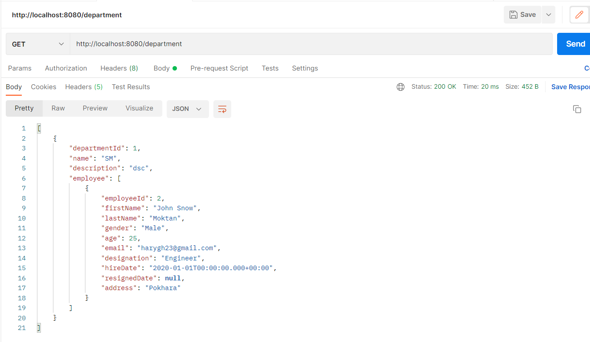
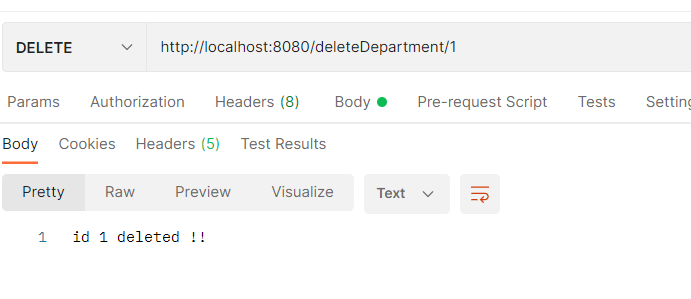
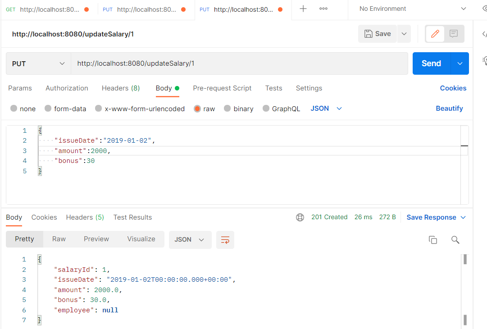

# Screen Shots

## Department

### Post department

### Get all department

### Get department by id

### Put department

### Delete department

### Post Salary

### Get all Salary

### Get Salary by id

### Put Salary

### Delete Salary

### Post Project

### Get all Project

### Get Project by id

### Put Project

### Delete Project

### Post Employee

### Get all Employee

### Get Employee by id

### Get Employee by designation

### Put Employee

### Delete Employee

